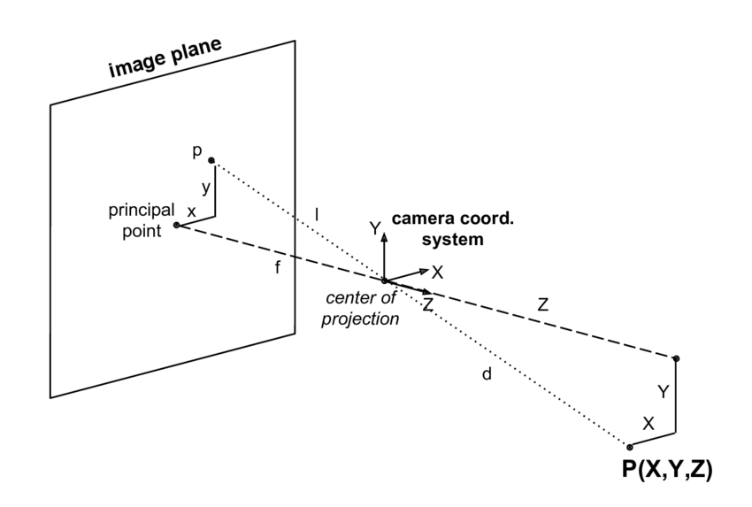

# Ball Tracking Robot
Replace this text with a brief description (2-3 sentences) of your project. This description should draw the reader in and make them interested in what you've built. You can include what the biggest challenges, takeaways, and triumphs from completing the project were. As you complete your portfolio, remember your audience is less familiar than you are with all that your project entails!

| **Engineer** | **School** | **Area of Interest** | **Grade** |
|:--:|:--:|:--:|:--:|
| Sid C | Saratoga High School | Electrical Engineering | Incoming Sophemore


  
# First Milestone

<iframe width="560" height="315" src="https://www.youtube.com/embed/JYsO4lLyrWs?si=TTcubbtoqlqyc-bj" title="YouTube video player" frameborder="0" allow="accelerometer; autoplay; clipboard-write; encrypted-media; gyroscope; picture-in-picture; web-share" referrerpolicy="strict-origin-when-cross-origin" allowfullscreen></iframe>

**Technical Progress**
- Currently, the robot is made up of of two motors, a Raspberry Pi 4, a L9110 H-bridge, a breadboard, and a ultrasonic sensor.

  **Setting up the Raspberry Pi 4**
  - I started by storing necessary data and configurations on to a SD card through Raspberry Pi Imager. After inserting the SD card into the Raspberry Pi 4, the device was connected remotely with my computer through SSH over the same network. Then I created a folder on the Pi for my project with VS Code.

  **Controlling the Motors**
  - The two motors connect to the H-bridge(the driver) then to different GPIO pins on the Pi. I was able to control the motors to move forward and backward with VS Code. Each motor needed to be connected to two pins because it required a complete circuit to operate.

  **Ultrasonic Sensor**
  - The ultrasonic sensor's echo wire needs to have a voltage cap of 3.3V, so I need to set up a circuit with 1K and 2K resistors on the breadboard. The Trigger pin continuously sends out waves, and the Echo pin receives the reflected waves. Distance can then be calculated with the time it takes for the cho pin to receive the wave.

**Challenges**
- I couldn’t run the code to drive the motors. We found out that this was because my program file was on my desktop, when it should have been on the Pi. So I moved the file to the Pi, and it worked.

- The second challenge that I faced was that VS Code couldn’t connect to the Pi, while my MacBook’s built-in terminals could. We tested many different methods on the terminal but didn’t see any issues until we saw a small pop-up on the VS Code settings icon. We needed to update the app for it to connect to the Pi.

**Next Steps**
- I attached the camera to the Pi and took an image with it. I will be completing seting up the camera and get it to work with the motorrs and the ultrasonic sensor.

- If I am able to have different parts working together, I can put everything components on the body of the robot and add a power bank so I don't need an external wire. 

# Schematics 
Here's where you'll put images of your schematics. [Tinkercad](https://www.tinkercad.com/blog/official-guide-to-tinkercad-circuits) and [Fritzing](https://fritzing.org/learning/) are both great resoruces to create professional schematic diagrams, though BSE recommends Tinkercad becuase it can be done easily and for free in the browser. 


# Code

```python
from gpiozero import Motor
from gpiozero import DistanceSensor
motorL = Motor(13,23)
motorR = Motor(12,24)
ultrasonic = DistanceSensor(echo=17, trigger=27, threshold_distance=0.5)
while True:
    while (ultrasonic.distance>0.15):
        motorL.stop()
        motorR.stop()
        print(ultrasonic.distance*100,"cm")
        motorL.forward()
    while (ultrasonic.distance<=0.15):
        motorL.stop()
        motorR.stop()
        print(ultrasonic.distance*100,"cm")
        motorR.forward()
```
# Second Milestone

<iframe width="560" height="315" src="https://www.youtube.com/embed/45s7Z6GL7cs?si=bAOA9M94EwENtnzi" title="YouTube video player" frameborder="0" allow="accelerometer; autoplay; clipboard-write; encrypted-media; gyroscope; picture-in-picture; web-share" referrerpolicy="strict-origin-when-cross-origin" allowfullscreen></iframe>

**Technical Progress**
- A Pi camera and an unltrasonic sensor were added. Base project is completed. The robot is able to track the ball based on offsets to the center of the frame and to the target distance. The robot can also search when the ball is not in camera's range.

  **Image Segmentation/Erosion/Dilation**
  - Isolate the red portions from the background
  - The noise is eroded (take away 2 pixels around), then the pixels next to the noise are dilated (add 2 pixels back)

  **Contouring/Centroid**
  - Identify the boundaries of red objects within camera's range
  - Using function from OpenCV library, identify the object(ball) with the largest area
  - Centroid is the center of the ball which is calculated by averaging the XY-values on the contour

  **PID**
  - P(proportional), I(Integral), D(Derivative)
  - P: the motors spin faster or slower based on offset of distance and angle
  - The bigger the offset, the faster the motors spin, vice versa
  - I: Accumulates past errors over time
  - Eliminate steady-state errors. Cause issues when the value is set to be too high.
  - D: Responds to the rate of change of the offset(previous offset)
  - Dampen oscillations and improve stability
  - Two PIDs to control distance & turn speed

  **Track Distance & Angle with Camera**
  - To track the offset of the ball from the center of the camera, subtract the X-value of center by the X-value of the centroid
  - To use the camera to calculate the distance, I needed to use the perceived size of the ball from the camera: the smaller the perceived size is, the further it is, vice versa
  - The focal length of the camera is found in the following formula. It is experimental so distance it finds won't be very accurate. 
  - Focal Length (pixels) = (Distance(cm) * Real Distance to Ball(cm)) / Perceived Ball Width (pixels)

    
  - Then, distance can be calculated:
  - Distance(cm) = (Focal Length (pixels) / Real Ball Width(cm) * Perceived Ball Width (pixels)

  **Search Ball**
  - The robot will be constanly turning around if no ball is found in the camera range.
  - Search function runs when the contour does not exist, meaning that no red object is detected, or when the red object detected has a radius less than 20 pixels. It is really hard for the ball to be so far such that it has a radius less than 20, so the object must not be the ball which the robot shouldn't track.

**Challenges**
- I initially had the robot to turn and move toward or away from the ball at the same time. The robot would turn too much and constantly oscilating. It was because the distance when robot is close to the ball isn't accurate. The robot would incorrectly recognize the ball to be too far when most of the ball is out of camera's range. So I adjusted the code such that the robot only move toward or away from the ball when the ball is centered.

- The second challenge I faced was that the robot couldn't center the ball and therefore may not move toward or away from it. It was because when the offset was too small, the speed calculated by PID was not fast enough for the wheel to start spinning. I found the approximate threshold speed fromt he wheels to start spinning. A conditional when the speed is less than threshold speed, the threshold speed will be the new speed. If the threshold speed is too big, the robot would oscilate too much; if the threshold speed is too small, the robot simply would not move.

- The final challenge that prevented my robot to accurately track the ball was that the turns were too big such that the ball could easily get out of range. So I added a conditional when the rasius of the ball is within the given range, the turn speed would be decreased based on the radius. The range was a little bit tricky to set because if the upper limit is too high, the speed will be reduced significantly when the ball is close to the camera and partially cut off.

**Next Step**
- I will be adding modifications specifically make the robot gesture controlled and sound reactive to my voice. It will be challenging to integrate them. Because this is a ball tracking robot, I will add a switch for it to be automatic or controllable.

# Code

```python
from flask import Flask, Response, render_template_string
from picamera2 import Picamera2
import cv2
import numpy as np
from gpiozero import Motor
import time
#initialize motors
motorL = Motor(13,23)
motorR = Motor(12,24)
motorL.stop()
motorR.stop()
app = Flask(__name__)

# Initialize PiCam
picam2 = Picamera2()
picam2.configure(picam2.create_preview_configuration(main={"format": "RGB888", "size": (640, 480)}))
picam2.start()
FOCAL_LENGTH = 534.643275487 #pixels, experimental
BALL_DIAMETER = 7*2.54 #cm

#PID Variables (kp, ki, kd are constant)
kp_turn = 0.0015
ki_turn = 0.000005
kd_turn = 0.001
iOffset_turn = 0
prevOffset_turn = 0

kp_distance = 0.0016
ki_distance = 0.000006
kd_distance = 0.001
iOffset_distance = 0
prevOffset_distance = 0

TARGET_BALL_DISTANCE = 20 #cm
THRESHOLD_SPEED = 0.231 #Wheels don't start spinning until the speed is around 0.231.
FRAME_WIDTH = 640
CENTER_X = FRAME_WIDTH // 2

def PID_turn(offset_turn):
    global iOffset_turn, prevOffset_turn
    iOffset_turn = max(-500, min(500, iOffset_turn + offset_turn))

    dOffset_turn = offset_turn - prevOffset_turn
    P = kp_turn * offset_turn
    I = ki_turn * iOffset_turn
    D = kd_turn * dOffset_turn
    prevOffset_turn = offset_turn
    return P + I + D

def PID_distance(offset_distance):
    global iOffset_distance, prevOffset_distance
    iOffset_distance = max(-500, min(500, iOffset_distance + offset_distance))

    dOffset_distance = offset_distance - prevOffset_distance
    P = kp_distance * offset_distance
    I = ki_distance * iOffset_distance
    D = kd_distance * dOffset_distance
    prevOffset_distance = offset_distance
    return P + I + D

def search(): #The frame rate will drop significantly when searching because it takes 0.1 sec more to return frame
    motorR.forward(speed = 0.35)
    motorL.backward(speed= 0.35)
    time.sleep(0.05)
    motorR.stop()
    motorL.stop()
    time.sleep(0.05)
    print("Searching")

def track_red_ball(frame):
    hsv = cv2.cvtColor(frame, cv2.COLOR_BGR2HSV)    #Convert BGR(default of Pi camera) to HSV
    lower_red1 = np.array([0, 100, 100])
    upper_red1 = np.array([10, 255, 255])
    lower_red2 = np.array([160, 100, 100])
    upper_red2 = np.array([179, 255, 255])
    
    mask1 = cv2.inRange(hsv, lower_red1, upper_red1)
    mask2 = cv2.inRange(hsv, lower_red2, upper_red2)
    mask = cv2.bitwise_or(mask1, mask2)
    
    mask = cv2.erode(mask, None, iterations=2)      #Remove 2 pixels around noise
    mask = cv2.dilate(mask, None, iterations=2)     #Add back the pixels

    #Contour(image segmentation) and centroid
    contours, _ = cv2.findContours(mask, cv2.RETR_EXTERNAL, cv2.CHAIN_APPROX_SIMPLE)

    if contours:
        largest = max(contours, key=cv2.contourArea)
        M = cv2.moments(largest)
        if M["m00"] > 0:
            cx = int(M["m10"]/M["m00"])     #Average of XY-values on the contours
            cy = int(M["m01"]/M["m00"])     #will be the center(centroid) of the object

            #Use radius to see if the object detected is the ball. Not the ball if radius<20
            ((x, y), radius) = cv2.minEnclosingCircle(largest)
            
            if radius > 20:

                #Find offset distance from target distance of ball then calculate distanceSpeed
                distance = 534.643275487 * BALL_DIAMETER / (radius*2) #Using focal length to calc distance. pixels*cm/pixels = cm Focal Length * real width / perceived width
                offset_distance = distance - TARGET_BALL_DISTANCE
                distanceSpeed = 10*PID_distance(offset_distance) #distance in cm is smaller than offset_turn 
                if distanceSpeed > 0.7:
                    distanceSpeed = 0.7

                #Find offset from center then calculate turnSpeed
                offset_turn = cx - CENTER_X
                turnSpeed = PID_turn(offset_turn)
                if radius > 45 and radius <120:
                    turnSpeed = (turnSpeed/distance)*28
                if turnSpeed >0.4: #Prevent from overturning
                    turnSpeed = 0.4

                if offset_distance < -3:
                    positionD = "Too close"
                elif offset_distance > 3:
                    positionD = "Too far"
                else:
                    positionD = "Centered"
                if abs(offset_turn) < 40:
                    position = "Centered"
                    Speed = distanceSpeed #Negative when too close; Positive when too far
                    if Speed < THRESHOLD_SPEED: 
                        Speed = THRESHOLD_SPEED
                    elif abs(Speed) > 0.6: #Prevent from going too fast
                        Speed = 0.6
                    if abs(offset_distance)<3:
                        position = "Perfectly Centered"
                        positionD = "Perfectly Centered"
                        Speed = 0
                    motorR.value = Speed
                    motorL.value = Speed
                    print(Speed)
                else: #Turn only without moving backward or forward
                    Speed = abs(turnSpeed)
                    if Speed < THRESHOLD_SPEED:
                        Speed = THRESHOLD_SPEED
                    elif Speed > 0.42: #Prevent from turning too fast. It overshoots a lot without this conditional
                        Speed = 0.42
                    if offset_turn < 0:
                        position = "Left"
                        motorR.forward(speed = Speed)
                        motorL.backward(speed = Speed)
                    elif offset_turn > 0:
                        position = "Right"
                        motorL.forward(speed = Speed)
                        motorR.backward(speed = Speed)
                print(Speed)
                cv2.drawContours(frame, [largest], -1, (0,255,0), 2)
                cv2.circle(frame, (cx,cy), 5, (255,0,0),-1)
                cv2.putText(frame, f"Offset_turn: {offset_turn} ({position})", (cx-120, cy-30), #Label the object with its "Position"
                            cv2.FONT_HERSHEY_SIMPLEX, 0.7, (255,255,255), 2)
                cv2.putText(frame, f"Offset_distance: {offset_distance//1} ({positionD})", (cx-120, cy-60), #Label the object with its "PositionD"
                            cv2.FONT_HERSHEY_SIMPLEX, 0.7, (255,255,255), 2)
                cv2.putText(frame, f"Radius: {radius//1.00} ", (cx-100, cy-90), #Label the object with its "PositionD"
                            cv2.FONT_HERSHEY_SIMPLEX, 0.7, (255,255,255), 2)        
            else: 
                search()
        
    else: #Search if no object found
        motorR.stop()
        motorL.stop()
        search()
            
    return frame

def generate_frames():
    while True:
        frame = picam2.capture_array()
        frame = track_red_ball(frame)
        ret, buffer = cv2.imencode('.jpg', frame)
        jpg_frame = buffer.tobytes()
        yield (b'--frame\r\n'
               b'Content-Type: image/jpeg\r\n'
               b'Content-Length: ' + f"{len(jpg_frame)}".encode() + b'\r\n\r\n' +
               jpg_frame + b'\r\n')
        
@app.route('/')
def index():
    return render_template_string('''
        <html>
            <head><title>Red Ball Tracking Stream</title></head>
            <body>
                <h2>Live Tracking</h2>
                
            </body>
        </html>
    ''')

@app.route('/video_feed')
def video_feed():
    return Response(generate_frames(),
                    mimetype='multipart/x-mixed-replace; boundary=frame')

if __name__ == '__main__':
    app.run(host='0.0.0.0', port=5000)
```

# Final Milestone

<iframe width="560" height="315" src="https://www.youtube.com/embed/rCklncO7jy8?si=tOwZ4qrkTB4DiZwJ" title="YouTube video player" frameborder="0" allow="accelerometer; autoplay; clipboard-write; encrypted-media; gyroscope; picture-in-picture; web-share" referrerpolicy="strict-origin-when-cross-origin" allowfullscreen></iframe>
**Technical Progress**
- A controller with a Raspberry Pi Zero 2W was added with an RGBLED and three buttons.

  **Raspberry Pi Zero 2W**
  - The Raspberry Pi Zero was used to be connected so the controller so it can interact with Pi 4.
  - The Pi Zero powers the parts on the breadboard and read their information.

  **Accelerometer and Gesture Control**
  - Mesures the Acceleration in XYZ axes.
  - The Pi Zero will then send the acceleration of XY axes to Pi 4.
  - Pi 4 can determine which direction I am tilting it to and control the motors.

  **WebSocket**
  - A communication between a client and a server or the host using the IP address of the host.
  - The client, in this case is the Raspberrypi Zero.
  - Th Pi Zero sends the information about the switch-mode button, the color the robot should track, and the data from accelerometer every 0.1 seconds.
  - When sending the data from the controller, I used JSON send many information at once, and it encodes data in to bytes to be able to send. The Pi 0 sends the XY-acceleration, the color to track, and a "SwitchMode" variable that is true when the middle button is pressed as a packet. The Pi 4 decodes and parses the data. 

  **Threading and Queue**
  - 1
  - 3
  - 3

  **Buttons and RGBLED**
  - There are three buttons and an RGBLED connected to the Pi Zero.
  - The middle button switches mode; the other two increment or decrement the color number the robot is tracking.
  - The RGBLED displays the color the robot is tracking. The light is turned off when tracking black because black light doesn't exist.

  **Full Integration of All**
  - The program is started with manual mode as default. In manual mode, the live feed will display the distances of the three ultrasonic sensors. In auto mode, the live feed displays the offset from the center of the camera and the offset distance to the object. The distance is calculated with the size of the object when tracking red because it is supposed to track the red ball and its size is known; when tracking other colors, the distance is calculated with the ultrasonic sensor at the front. When the robot is searching for the object, "Searching..." is also displayed.
  -  In both modes, the the live feed display the color number the robot is tracking, the speed, and the current mode.
  -  In manual mode, the Pi 4 uses the data from the accelerometer connected to Pi 0. The Pi 0 will continuosly send color number to track, although it is not usedThe color tracking can be switched but it won't affect robot's movement since it is not in auto mode. The Pi 0 will continuosly send the data from the accelerometer, although it is not used
  -  When I press the switch mode button, the "SwitchMode" variable becomes true and is sent to the Pi 4.
  -  In auto mode, the Pi 0 will continuosly send the data from the accelerometer, although it is not used. The robot tracks the biggest object of the assigned color 

**Challenges**
- I faced the biggest challenge that almost sabatoge all the modifications. After flashing an SD card and insert it in Raspberrypi Zero 2W, I downloaded the upgrade files and try to run some simple codes on VSCode to test the connection, but then the connection would crash and I wouldn't be able to connect with the Pi 0 through VSCode anymore, but I could still connect through the built-in terminal on my Macbook. I tried flashing my SD card over and over again and delete the updrade files and re-download, but the connection would still fail whenever I tried to run the codes. So I decided to run the codes through terminal on my Macbook on the day of the demo night. I already finished the codes but hadn't tested, so I copied the file to the Pi 0 and run on terminal. It worked out really well.

- Another challenge was a lot easier to be discovered and resolved than the previous one. The live feed crashed when I press the button that switch mode. I had the program to print out the data that was sent to Pi 4 and found out that in many packages of data sent from Pi 0, the variable for switch mode is true. Because the data is sent every 0.1 seconds, the time from the button was pressed to rise is enough to sent out multiple packages that had the switch-mode variable to be true and caused the lie feed to crash. So I added many conditions to ensure that the switch-mode variable would only be true in one package of data.

- I got really lucky: I had never tested anything on my controller, including RGBLED, buttons, and accelerometer which I had not used before because I wasn't able to run codes on Pi 0, but everything ran as intended; the accelerometer has directions, and I did't have time to test it, but it waas the same direction as I coded; lastly, the RGLED can be either cathode (need to be connected to -) or anode (need to be connected to +) because it is a diode that has a direction, but I didn't know until I made the schematic. It turned out to be a cathode, which means if I connected it to positive power source, I woudn't have been able to figure out the problem before Demo night so the RGBLED and the related features wouldn't have been successful at all.

# Code
**Robot (Raspberry Pi 4)**
```python
from flask import Flask, Response, render_template_string
from picamera2 import Picamera2
import cv2
import numpy as np
from gpiozero import Motor, DistanceSensor
import time
import socket
import json
import struct
import threading
import queue # For thread-safe communication

# --- Global Configuration ---
HOST = "0.0.0.0"  # Listen on all available network interfaces
PORT = 65432      # The port used by the server

# --- Initialize Hardware Globally ---
motorL = Motor(13, 23)
motorR = Motor(12, 24)
motorL.stop()
motorR.stop()

ultrasonicL = DistanceSensor(echo=17, trigger=27, threshold_distance=0.5)
ultrasonicR = DistanceSensor(echo=16, trigger=26, threshold_distance=0.5)
ultrasonicF = DistanceSensor(echo=15, trigger=25, threshold_distance=0.5)

# Initialize PiCam
picam2 = Picamera2()
picam2.configure(picam2.create_preview_configuration(main={"format": "RGB888", "size": (640, 480)}))
picam2.start()

app = Flask(__name__)

# --- Global Variables for Robot State & Control ---
# These variables are accessed/modified by multiple threads, so protect them with a lock
mode = 'manual' # MODE can be 'manual' or 'auto'
manual_speed = 0.4
color = 1 # Default track red
Speed = 0 # Current robot speed (for auto mode)

# Variables for manual control input from client
client_x_input = 0.0
client_y_input = 0.0

#PID Variables (kp, ki, kd are constant)
kp_turn = 0.0015
ki_turn = 0.000005
kd_turn = 0.001
iOffset_turn = 0
prevOffset_turn = 0

kp_distance = 0.0016
ki_distance = 0.000006
kd_distance = 0.001
iOffset_distance = 0
prevOffset_distance = 0

TARGET_DISTANCE = 20 #cm
THRESHOLD_SPEED = 0.231 #Wheels don't start spinning until the speed is around 0.231.
FRAME_WIDTH = 640
CENTER_X = FRAME_WIDTH // 2
FOCAL_LENGTH = 534.643275487 #pixels, experimental, used only when tracking redball
BALL_DIAMETER = 7*2.54 #cm

# --- Thread-safe queue for incoming socket data ---
socket_data_queue = queue.Queue()

# --- Threading Lock for Global Variables ---
global_vars_lock = threading.Lock()

# --- Helper Function to ensure all bytes are received ---
def receive_all(sock, n_bytes):
    #Helper function to ensure all 'n_bytes' are received from the socket.
    data = b''
    while len(data) < n_bytes:
        packet = sock.recv(n_bytes - len(data))
        if not packet:
            return None # Connection closed or error
        data += packet
    return data

# --- Socket Listener Thread Function ---
def socket_listener():
    print(f"Socket listener starting on {HOST}:{PORT}")
    while True: # Keep the server running even if a client disconnects
        with socket.socket(socket.AF_INET, socket.SOCK_STREAM) as s:
            s.setsockopt(socket.SOL_SOCKET, socket.SO_REUSEADDR, 1) # Allows immediate reuse of address
            s.bind((HOST, PORT))
            s.listen()
            print("Waiting for a client connection...")
            conn, addr = s.accept()
            with conn:
                print(f"Connected by {addr}")
                while True:
                    # 1. Receive the 4-byte message length prefix
                    raw_msg_len = receive_all(conn, 4)
                    if not raw_msg_len: # Client disconnected
                        print(f"Client {addr} disconnected.")
                        break # Exit inner while loop to wait for new client

                    msg_len = struct.unpack('>I', raw_msg_len)[0] #msg_len is the num of bytes of the data

                    # 2. Receive the actual JSON message based on the length
                    json_data_bytes = receive_all(conn, msg_len)
                    if not json_data_bytes: # Client disconnected during data receipt
                        print(f"Client {addr} disconnected prematurely.")
                        break # Exit inner while loop

                    # 3. Decode the bytes to a UTF-8 string
                    json_string = json_data_bytes.decode('utf-8')
                    # print(f"Received raw JSON string: {json_string}") # Uncomment for debugging

                    # 4. Parse the JSON string into a Python dictionary
                    received_data = json.loads(json_string)

                    # Put the received data into the queue for the main thread
                    socket_data_queue.put(received_data)

# --- Helper Functions for Robot Control and Vision ---
def PID_turn(offset_turn):
    global iOffset_turn, prevOffset_turn
    iOffset_turn = max(-500, min(500, iOffset_turn + offset_turn))

    dOffset_turn = offset_turn - prevOffset_turn
    P = kp_turn * offset_turn
    I = ki_turn * iOffset_turn
    D = kd_turn * dOffset_turn
    prevOffset_turn = offset_turn
    return P + I + D

def PID_distance(offset_distance):
    global iOffset_distance, prevOffset_distance
    iOffset_distance = max(-500, min(500, iOffset_distance + offset_distance))

    dOffset_distance = offset_distance - prevOffset_distance
    P = kp_distance * offset_distance
    I = ki_distance * iOffset_distance
    D = kd_distance * dOffset_distance
    prevOffset_distance = offset_distance
    return P + I + D

def search(): #The frame rate will drop significantly when searching because it takes 0.7 sec more to return frame
    motorR.forward(speed = 0.35)
    motorL.backward(speed= 0.35)
    time.sleep(0.05)
    motorR.stop()
    motorL.stop()
    time.sleep(0.035)
    print("Searching")
    with global_vars_lock: # Protect access to global Speed
        global Speed
        Speed = 0.35

#Different colors of masks
def get_color_mask(hsv_frame):
    with global_vars_lock: # Protect access to global color
        current_color = color # Read the color value
    
    if current_color  == 1: # Red
        lower_red1 = np.array([0, 100, 100])
        upper_red1 = np.array([10, 255, 255])
        lower_red2 = np.array([160, 100, 100])
        upper_red2 = np.array([179, 255, 255])
        mask_red1 = cv2.inRange(hsv_frame, lower_red1, upper_red1)
        mask_red2 = cv2.inRange(hsv_frame, lower_red2, upper_red2)
        return cv2.bitwise_or(mask_red1, mask_red2)
    else:
        # Define ranges for other colors
        color_ranges = {
            2: ([10, 100, 100], [25, 255, 255]), # Orange
            3: ([25, 100, 100], [35, 255, 255]), # Yellow
            4: ([35, 50, 50], [85, 255, 255]),   # Green
            5: ([90, 50, 50], [130, 255, 255]),  # Blue
            6: ([130, 50, 50], [160, 255, 255]), # Purple / Magenta
            7: ([0, 0, 200], [179, 50, 255]),    # White
            8: ([0, 0, 0], [179, 255, 50])       # Black

        }
        lower_mask, upper_mask = color_ranges.get(current_color, (None, None))
        return cv2.inRange(hsv_frame, np.array(lower_mask), np.array(upper_mask))

def track(frame):
    global Speed, mode
    # Acquire lock before reading global mode and Speed for thread safety
    with global_vars_lock:
        current_mode = mode
        current_speed_auto = Speed # Read the current auto speed
    
    # This function should only be called if in auto mode, but added check for robustness
    if current_mode != 'auto':
        return frame 

    hsv = cv2.cvtColor(frame, cv2.COLOR_BGR2HSV)
    current_mask = get_color_mask(hsv) # Use the renamed function
    current_mask = cv2.erode(current_mask, None, iterations=2)
    current_mask = cv2.dilate(current_mask, None, iterations=2)

    contours, _ = cv2.findContours(current_mask, cv2.RETR_EXTERNAL, cv2.CHAIN_APPROX_SIMPLE)

    if contours:
        largest = max(contours, key=cv2.contourArea)
        M = cv2.moments(largest)
        if M["m00"] > 0:
            cx = int(M["m10"]/M["m00"])     #Average of XY-values on the contours
            cy = int(M["m01"]/M["m00"])     #will be the center(centroid) of the object

            #Use radius to see if the object detected is the ball. Not the ball if radius<20
            ((x, y), radius) = cv2.minEnclosingCircle(largest)
            
            if radius > 20:
                if color == 1:
                    #Find offset distance from target distance of ball then calculate distanceSpeed
                    distance = 534.643275487 * BALL_DIAMETER / (radius*2) #Using focal length to calc distance. pixels*cm/pixels = cm Focal Length * real width / perceived width
                else:
                    distance = ultrasonicF.distance*100
                offset_distance = distance - TARGET_DISTANCE
                distanceSpeed = 10*PID_distance(offset_distance) #distance in cm is smaller than offset_turn 
                if distanceSpeed > 0.7:
                    distanceSpeed = 0.7

                #Find offset from center then calculate turnSpeed
                offset_turn = cx - CENTER_X
                turnSpeed = PID_turn(offset_turn)
                if radius > 45 and radius <120:
                    turnSpeed = (turnSpeed/distance)*28
                if turnSpeed >0.4: #Prevent from overturning
                    turnSpeed = 0.4

                if offset_distance < -3:
                    positionD = "Too close"
                elif offset_distance > 3:
                    positionD = "Too far"
                else:
                    positionD = "Centered"
                if abs(offset_turn) < 40:
                    position = "Centered"
                    Speed = distanceSpeed #Negative when too close; Positive when too far
                    if Speed < THRESHOLD_SPEED: 
                        Speed = THRESHOLD_SPEED
                    elif abs(Speed) > 0.6: #Prevent from going too fast
                        Speed = 0.6
                    if abs(offset_distance)<3:
                        position = "Perfectly Centered"
                        positionD = "Perfectly Centered"
                        Speed = 0
                    motorR.value = Speed
                    motorL.value = Speed
                else: #Turn only without moving backward or forward
                    Speed = abs(turnSpeed)
                    if Speed < THRESHOLD_SPEED:
                        Speed = THRESHOLD_SPEED
                    elif Speed > 0.4: #Prevent from turning too fast. It overshoots a lot without this conditional
                        Speed = 0.4
                    if offset_turn < 0:
                        position = "Left"
                        motorR.forward(speed = Speed)
                        motorL.backward(speed = Speed)
                    elif offset_turn > 0:
                        position = "Right"
                        motorL.forward(speed = Speed)
                        motorR.backward(speed = Speed)
                cv2.drawContours(frame, [largest], -1, (0,255,0), 2)
                cv2.circle(frame, (cx,cy), 5, (255,0,0),-1)
                cv2.putText(frame, f"Offset_turn: {offset_turn} ({position})", (cx-120, cy-30),
                            cv2.FONT_HERSHEY_SIMPLEX, 0.7, (255,255,255), 2)
                cv2.putText(frame, f"Offset_distance: {offset_distance//1} {ultrasonicF.distance*100//1} ({positionD})", (cx-120, cy-60),
                            cv2.FONT_HERSHEY_SIMPLEX, 0.7, (255,255,255), 2)
                cv2.putText(frame, f"Radius: {radius//1.00} ", (cx-100, cy-90),
                            cv2.FONT_HERSHEY_SIMPLEX, 0.7, (255,255,255), 2)

        else: # No valid moment
            motorR.stop()
            motorL.stop()
            search()
            cv2.putText(frame, f"Searching...", (20, 130), cv2.FONT_HERSHEY_SIMPLEX, 1, (0, 255, 255), 2)

    else: # No contours found
        motorR.stop()
        motorL.stop()
        search()
        cv2.putText(frame, f"Searching...", (20, 130), cv2.FONT_HERSHEY_SIMPLEX, 1, (0, 255, 255), 2)

    return frame

# --- Generator Function for Video Feed ---
def generate_frames():
    global mode, color, manual_speed, client_x_input, client_y_input, Speed # Declare global variables accessed/modified here
    
    with global_vars_lock:
        print(f"Current Mode: {mode.upper()}")
    print("-" * 20)
    
    while True:
        # --- Process incoming socket data (non-blocking) ---
        try:
            received_data = socket_data_queue.get(block=False) # Try to get data without blocking
            print(f"Received data from socket: {received_data}")
            
            with global_vars_lock: # Acquire lock before updating global variables
                if "Color" in received_data:
                    color = received_data["Color"]
                
                # Update X and Y inputs for manual control
                if "X" in received_data:
                    client_x_input = received_data["X"]
                if "Y" in received_data:
                    client_y_input = received_data["Y"]
                
                if "SwitchMode" in received_data and received_data["SwitchMode"] is True:
                    if mode == 'manual':
                        mode = 'auto'
                        motorL.stop() # Ensure motors stop when switching mode
                        motorR.stop()
                        # Reset PID integrators when switching to auto mode, so it wouldn't learn from the offsets of previous auto session
                        global iOffset_turn, prevOffset_turn, iOffset_distance, prevOffset_distance
                        iOffset_turn = 0
                        prevOffset_turn = 0
                        iOffset_distance = 0
                        prevOffset_distance = 0
                    elif mode == 'auto':
                        mode = 'manual'
                        motorL.stop() # Ensure motors stop when switching mode
                        motorR.stop()
                    print(f"Switched to {mode.upper()} mode.")
            
        except queue.Empty:
            # No new data from socket, continue
            pass

        frame = picam2.capture_array()

        # Read mode and current speed within a lock for safety
        with global_vars_lock:
            current_mode = mode
            current_speed_auto = Speed
            current_manual_speed = manual_speed
            current_x_input = client_x_input
            current_y_input = client_y_input

        if current_mode == 'auto':
            frame = track(frame) # track function handles motor control and updates global Speed
            cv2.putText(frame, "AUTO MODE", (20, 50), cv2.FONT_HERSHEY_SIMPLEX, 1, (0, 255, 255), 2)
            cv2.putText(frame, f"Speed: {current_speed_auto:.3f}", (20, 90), cv2.FONT_HERSHEY_SIMPLEX, 1, (0, 255, 255), 2)
            cv2.putText(frame, f"Color: {color}", (FRAME_WIDTH-200, 50), cv2.FONT_HERSHEY_SIMPLEX, 1, (0, 255, 255), 2)
        else: # In manual mode
            motorR.stop() # Ensure motors are stopped if not actively controlled by manual input
            motorL.stop()
            tilt_threshold = 4.0 # Adjust this threshold based on your client's X/Y range

            # Manual control logic based on X, Y input from client
            if current_x_input > tilt_threshold: # Tilt Right
                motorL.forward(speed = current_manual_speed)
                motorR.backward(speed = current_manual_speed)
            elif current_x_input < -tilt_threshold: # Tilt Left
                motorR.forward(speed = current_manual_speed)
                motorL.backward(speed = current_manual_speed)
            elif current_y_input > tilt_threshold: # Tilt Backward
                motorL.backward(speed = current_manual_speed)
                motorR.backward(speed = current_manual_speed)
            elif current_y_input < -tilt_threshold: # Tilt Forward
                if ultrasonicF.distance*100 < 25:#Don't move if running into something
                    motorL.stop()
                    motorR.stop()
                else:
                    motorL.forward(speed = current_manual_speed)
                    motorR.forward(speed = current_manual_speed)
            else: # No significant tilt, stop motors
                motorL.stop()
                motorR.stop()

            # Display information for manual mode
            cv2.putText(frame, "MANUAL MODE", (20, 50), cv2.FONT_HERSHEY_SIMPLEX, 1, (0, 255, 255), 2)
            cv2.putText(frame, f"Speed: {current_manual_speed:.2f}", (20, 90), cv2.FONT_HERSHEY_SIMPLEX, 1, (0, 255, 255), 2)
            
            # Display ultrasonic distances
            cv2.putText(frame, f"R: {ultrasonicR.distance * 100:.2f} cm", (FRAME_WIDTH - 150, 430), cv2.FONT_HERSHEY_SIMPLEX, 0.7, (0, 255, 255), 2)
            cv2.putText(frame, f"F: {ultrasonicF.distance * 100:.2f} cm", (CENTER_X - 70, 430), cv2.FONT_HERSHEY_SIMPLEX, 0.7, (0, 255, 255), 2)
            cv2.putText(frame, f"L: {ultrasonicL.distance * 100:.2f} cm", (20, 430), cv2.FONT_HERSHEY_SIMPLEX, 0.7, (0, 255, 255), 2)

        # Encode frame for streaming
        ret, buffer = cv2.imencode('.jpg', frame)

        jpg_frame = buffer.tobytes()
        yield (b'--frame\r\n'
               b'Content-Type: image/jpeg\r\n'
               b'Content-Length: ' + f"{len(jpg_frame)}".encode() + b'\r\n\r\n' +
               jpg_frame + b'\r\n')

# --- Flask Routes ---
@app.route('/')
def index():
    return render_template_string('''
        <html>
            <head><title>Robot Control & Tracking Stream</title></head>
            <body>
                <h2>Live Video Feed</h2>
                
            </body>
        </html>
    ''')

@app.route('/video_feed')
def video_feed():
    return Response(generate_frames(),
                    mimetype='multipart/x-mixed-replace; boundary=frame')

if __name__ == '__main__':
    # Start the socket listener in a separate thread
    socket_thread = threading.Thread(target=socket_listener, daemon=True) # daemon=True allows thread to exit with main program
    socket_thread.start()

    # Start the Flask web server
    # Set debug=False for production on Pi for better performance and to prevent multiple Flask instances
    app.run(host='0.0.0.0', port=5000, debug=False)
```
**Controller (Raspberry Pi Zero 2W)**
```python
import json
import socket
import struct # For packing/unpacking message length
import board
import busio
import adafruit_adxl34x # For accelerometer
from gpiozero import RGBLED, Button
from colorzero import Color as GpiozeroColor # Renamed Color import
import time

# --- Hardware Initialization ---
led = RGBLED(17,27,22)
buttonR = Button(5)
buttonL = Button(6)
buttonM = Button(7)

# Initialize I2C communication
# Ensure these pins (SCL, SDA) are correct for your Raspberry Pi model
i2c = busio.I2C(board.SCL, board.SDA)

# Initialize the accelerometer
accelerometer = adafruit_adxl34x.ADXL345(i2c)

# --- Global State Variables ---
# Use a different name for your color variable to avoid conflict with gpiozero.Color
current_color_id = 1 # 1: Red, 2: Orange, ..., 8: Black (or off)

# --- Network Configuration ---
HOST = "192.168.86.34"  # Replace with your Raspberry Pi's actual IP address
PORT = 65432            # The port used by the server

# --- Helper Function for LED Control ---
def set_led_color(color_id):
    #Sets the RGB LED color based on a numerical ID.
    global led # Ensure modifying the global led object
    if color_id == 1:
        led.color = GpiozeroColor('red')
    elif color_id == 2:
        led.color = GpiozeroColor('orange')
    elif color_id == 3:
        led.color = GpiozeroColor('yellow')
    elif color_id == 4:
        led.color = GpiozeroColor('green')
    elif color_id == 5:
        led.color = GpiozeroColor('blue')
    elif color_id == 6:
        led.color = GpiozeroColor('purple')
    elif color_id == 7:
        led.color = GpiozeroColor('white')
    elif color_id == 8: # Assuming 8 means off/black for your system
        led.off()

# --- Function to send JSON data with length-prefixing ---
def send_json_data(sock, data):

    #Encodes a Python dictionary to a JSON string, prefixes it with its length,
    #and sends it over the given socket.
    json_string = json.dumps(data)
    json_bytes = json_string.encode('utf-8') # Encode to bytes
    
    msg_len = len(json_bytes)
    # Pack the length into 4 bytes in network byte order (big-endian, unsigned integer)
    msg_len_prefix = struct.pack('>I', msg_len)
    
    sock.sendall(msg_len_prefix + json_bytes)

# --- Main Client Loop ---
if __name__ == '__main__':
    # Initial LED state
    set_led_color(current_color_id)
    print("Controller started. Waiting for connection...")

    # Use a flag for mode switching to ensure it's a toggle
    current_switch_mode_state = False # Track if a mode switch should be sent

with socket.socket(socket.AF_INET, socket.SOCK_STREAM) as s:
        s.connect((HOST, PORT))
        print(f"Connected to host {HOST}:{PORT}")

        # Keep sending data periodically
        while True:
            # --- Read Accelerometer Data ---
            x_accel, y_accel, z_accel = accelerometer.acceleration
            
            # --- Button Logic (NO DEBOUNCE) ---
            # These actions will occur for every loop iteration the button is pressed
            if buttonR.is_pressed:
                current_color_id = (current_color_id % 8) + 1 # Cycle through 1-8
                set_led_color(current_color_id)
                print(f"Color changed to: {current_color_id}")
            
            if buttonL.is_pressed:
                current_color_id -= 1
                if current_color_id < 1:
                    current_color_id = 8 # Cycle back to 8
                set_led_color(current_color_id)
                print(f"Color changed to: {current_color_id}")

            # Mode toggle button: only triggers ONCE per press (rising edge detection)
            send_mode_switch_command = False # Flag to send switch mode command
            if buttonM.is_pressed:
                if not buttonM_was_pressed_last_loop: # This means it was NOT pressed last loop, but IS pressed now
                    send_mode_switch_command = True
                    print("Mode button pressed")
                buttonM_was_pressed_last_loop = True # Update state for next loop
            else:
                buttonM_was_pressed_last_loop = False # Reset state when button is released

            # Prepare data to send
            data_to_send = {
                "Color": current_color_id,
                "SwitchMode": send_mode_switch_command, # Send the flag determined by rising edge
                "X": x_accel,
                "Y": y_accel}     
            
            # Send the data
            send_json_data(s, data_to_send)

            # Reset SwitchMode flag after sending, so it's only True for one packet
            current_switch_mode_state = False 
            time.sleep(0.1) # Send data approximately 10 times per second

```

# Bill of Materials
| **Part** | **Note** | **Price** | **Link** |
|:--:|:--:|:--:|:--:|
| Raspberry Pi 4 Kit | The primarily device that is in charge of controlling the robot | $95.19 | <a href="https://www.amazon.com/RasTech-Raspberry-Starter-Heatsink-Screwdriver/dp/B0C8LV6VNZ"> Link </a> |
| Robot Chassis | Base of Robot | $18.99 | <a href="https://www.amazon.com/Smart-Chassis-Motors-Encoder-Battery/dp/B01LXY7CM3"> Link </a> |
| Screwdriver Kit | Tighten screws on robot | $5.94 | <a href="https://www.amazon.com/Small-Screwdriver-Set-Mini-Magnetic/dp/B08RYXKJW9"> Link </a> |
| Ultrasonic Sensor | Track distance at the front of the robot | $9.99 | <a href="https://www.amazon.com/WWZMDiB-HC-SR04-Ultrasonic-Distance-Measuring/dp/B0CQCCGXCP"> Link </a> |
| H Bridges | To change the direction of rotation of DC motors | $8.99 | <a href="https://www.amazon.com/ACEIRMC-Stepper-Controller-2-5-12V-H-Bridge/dp/B0923VMKSZ"> Link </a> |
| Pi Camera | Detect objects of different colors and used for live feed | $12.86 | <a href="https://www.amazon.com/gp/product/B07RWCGX5K"> Link </a> |
| Electronics Kit | Used for wires, resistor, LEDs, buttons and breadboard | $11.98 | <a href="https://www.amazon.com/EL-CK-002-Electronic-Breadboard-Capacitor-Potentiometer/dp/B01ERP6WL4"> Link </a> |
| Motors | Spin the wheels | $11.98 | <a href="https://www.amazon.com/AEDIKO-Motor-Gearbox-200RPM-Ratio/dp/B09N6NXP4H"> Link </a> |
| SD Card Adapter | Used when flashing SD cards | $9.99 | <a href="https://www.amazon.com/dp/B081VHSB2V?"> Link </a> |
| Digital Multimeter (Not Used) | Measure electrical quantities | $11 | <a href="https://www.amazon.com/AstroAI-Digital-Multimeter-Voltage-Tester/dp/B01ISAMUA6"> Link </a> |
| Champion Sports Ball | The object for the robot to track | $16.73 | <a href="https://www.amazon.com/Champion-Sports-Inch-Coated-Density/dp/B000KYTTYO"> Link </a> |
| AA Batteries (Not Used) | Power source for the robot | $18.74 | <a href="https://www.amazon.com/Duracell-Coppertop-AA-Ingredients-Long-lasting/dp/B0035LCFNQ"> Link </a> |
| USB Power Bank & Cable | Power source for the robot | $16.19 | <a href="https://www.amazon.com/SIXTHGU-Portable-Charger-Charging-Flashlight/dp/B0C7PHKKNK"> Link </a> |
| Double Sided Tape | Ease of build for ball tracking robot | $7.99 | <a href="https://www.amazon.com/Adhesive-Mounting-Temperature-Resistance-Applications/dp/B0DJLV5J69"> Link </a> |
| Raspberry Pi Zero 2W | Modification: controller | $26.99 | <a href="https://www.amazon.com/gp/product/B0DKKXS4RV/ref=ewc_pr_img_3?smid=A1RK0V6ARA6ZY4&psc=1"> Link </a> |
| Accelerometer | Modification: Enable gesture control mode  | $9.00 | <a href="https://www.amazon.com/dp/B0BXWHTXWT?psc=1&smid=A1XEC9TMFJSNSW&ref_=chk_typ_imgToDp"> Link </a> |
| Adafruit Electret Microphone Amplifier - MAX4466 (Not Used) | Modification: Enable voice control mode | $13.99 | <a href="https://www.amazon.com/gp/product/B07S4DTKYH/ref=sw_img_1?smid=A2ZDGCOOU4F0SF&th=1"> Link </a> |
| M-F Jumpers | For controller | $6.63 | <a href="https://www.amazon.com/gp/product/B01EV70C78/ref=ox_sc_act_title_3?smid=A2WWHQ25ENKVJ1&psc=1"> Link </a> |
| F-F Jumpers (Not Used) | For controller | $6.63 | <a href="https://www.amazon.com/gp/product/B01EV70C78/ref=ox_sc_act_title_3?smid=A2WWHQ25ENKVJ1&psc=1"> Link </a> |
| Electrical Tape (Not Used) | Ensure the connection between LEDs and wire | $5.99 | <a href="https://www.amazon.com/gp/product/B09P16VMZT/ref=ox_sc_act_title_2?smid=A2G90RTZEVHFSB&psc=1"> Link </a> |
| Small Breadboards | To put accelerometer/RGBLED/Buttons on | $5.99 | <a href="https://www.amazon.com/WWZMDiB-SYB-170-Breadboard-Plates-Multicolored/dp/B09YXQJMTG"> Link </a> |

# Resources

- [Example Project](https://www.instructables.com/Ball-Tracking-Robot/)
- [Raspberry Pi OS](https://www.raspberrypi.com/documentation/computers/os.html#update-software)
- [VSCode SSH](https://code.visualstudio.com/docs/remote/ssh?WT.mc_id=academic-11397-jabenn)
- [Raspberry Pi Pinout](https://pinout.xyz/pinout/pwm)
- [Motor Driver (H-Bridge)](https://gpiozero.readthedocs.io/en/latest/api_output.html#motor)
- [GPIOzero](https://gpiozero.readthedocs.io/en/latest/api_output.html#motor)
- [Ultrasonic Sensor](https://projects.raspberrypi.org/en/projects/physical-computing/12)
- [Ultrasonic Sensor Wiring](https://thepihut.com/blogs/raspberry-pi-tutorials/hc-sr04-ultrasonic-range-sensor-on-the-raspberry-pi?srsltid=AfmBOooFDJioAYhsYTenn4rwW55RYaGmaA7v3zI6MlYms_1h6eB3uu35)
- [Pi Camera 2 in Virtual Environment](https://forums.raspberrypi.com/viewtopic.php?t=361758)
- [Threading](https://docs.python.org/3/library/threading.html)
