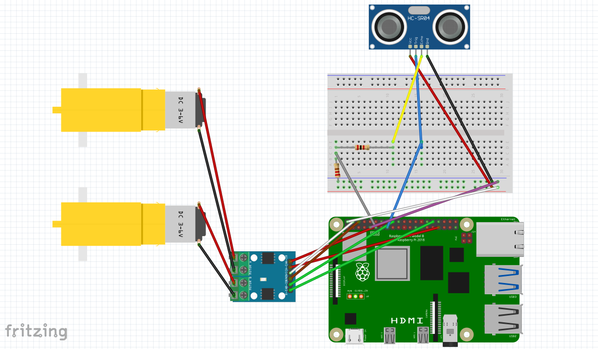

# Ball Tracking Robot
Replace this text with a brief description (2-3 sentences) of your project. This description should draw the reader in and make them interested in what you've built. You can include what the biggest challenges, takeaways, and triumphs from completing the project were. As you complete your portfolio, remember your audience is less familiar than you are with all that your project entails!

You should comment out all portions of your portfolio that you have not completed yet, as well as any instructions:
```HTML 
<!--- This is an HTML comment in Markdown -->
<!--- Anything between these symbols will not render on the published site -->
```

| **Engineer** | **School** | **Area of Interest** | **Grade** |
|:--:|:--:|:--:|:--:|
| Sid C | Saratoga High School | Electrical Engineering | Incoming Sophemore

**Replace the BlueStamp logo below with an image of yourself and your completed project. Follow the guide [here](https://tomcam.github.io/least-github-pages/adding-images-github-pages-site.html) if you need help.**


  
# First Milestone

**Don't forget to replace the text below with the embedding for your milestone video. Go to Youtube, click Share -> Embed, and copy and paste the code to replace what's below.**

<iframe width="560" height="315" src="https://www.youtube.com/embed/JYsO4lLyrWs?si=TTcubbtoqlqyc-bj" title="YouTube video player" frameborder="0" allow="accelerometer; autoplay; clipboard-write; encrypted-media; gyroscope; picture-in-picture; web-share" referrerpolicy="strict-origin-when-cross-origin" allowfullscreen></iframe>

**Technical Progress**
- Currently, the robot is made up of of two motors, a Raspberry Pi 4, a L9110 H-bridge, a breadboard, and a ultrasonic sensor.

- **Setting up the Raspberry Pi**
  I started by storing necessary data and configurations on to a SD card through Raspberry Pi Imager. After inserting the SD card into the Raspberry Pi 4, the device was connected remotely with my computer through SSH over the same network. Then I created a folder on the Pi for my project with VS Code.

- **Controlling the Motors**
  The two motors connect to the H-bridge(the driver) then to different GPIO pins on the Pi. I was able to control the motors to move forward and backward with VS Code. Each motor needed to be connected to two pins because it required a complete circuit to operate.

- **Ultrasonic Sensor:**
  The ultrasonic sensor's echo wire needs to have a voltage cap of 3.3V, so I need to set up a circuit with 1K and 2K resistors on the breadboard. The Trigger pin continuously sends out waves, and the Echo pin receives the reflected waves. Distance can then be calculated with the time it takes for the cho pin to receive the wave.

**Challenges**
- I couldn’t run the code to drive the motors. We found out that this was because my program file was on my desktop, when it should have been on the Pi. So I moved the file to the Pi, and it worked.
- The second challenge that I faced was that VS Code couldn’t connect to the Pi, while my MacBook’s built-in terminals could. We tested many different methods on the terminal but didn’t see any issues until we saw a small pop-up on the VS Code settings icon. We needed to update the app for it to connect to the Pi.

**Next Steps**
- I attached the camera to the Pi and took an image with it. I will be completing seting up the camera and get it to work with the motorrs and the ultrasonic sensor.
- If I am able to have different parts working together, I can put everything components on the body of the robot and add a power bank so I don't need an external wire. 

# Schematics 
Here's where you'll put images of your schematics. [Tinkercad](https://www.tinkercad.com/blog/official-guide-to-tinkercad-circuits) and [Fritzing](https://fritzing.org/learning/) are both great resoruces to create professional schematic diagrams, though BSE recommends Tinkercad becuase it can be done easily and for free in the browser. 


# Code
Here's where you'll put your code. The syntax below places it into a block of code. Follow the guide [here]([url](https://www.markdownguide.org/extended-syntax/)) to learn how to customize it to your project needs. 

```c++
void setup() {
  // put your setup code here, to run once:
  Serial.begin(9600);
  Serial.println("Hello World!");
}

void loop() {
  // put your main code here, to run repeatedly:

}
```
# Second Milestone

**Don't forget to replace the text below with the embedding for your milestone video. Go to Youtube, click Share -> Embed, and copy and paste the code to replace what's below.**

<iframe width="560" height="315" src="https://www.youtube.com/embed/y3VAmNlER5Y" title="YouTube video player" frameborder="0" allow="accelerometer; autoplay; clipboard-write; encrypted-media; gyroscope; picture-in-picture; web-share" allowfullscreen></iframe>

For your second milestone, explain what you've worked on since your previous milestone. You can highlight:
- Technical details of what you've accomplished and how they contribute to the final goal
- What has been surprising about the project so far
- Previous challenges you faced that you overcame
- What needs to be completed before your final milestone 


# Final Milestone

**Don't forget to replace the text below with the embedding for your milestone video. Go to Youtube, click Share -> Embed, and copy and paste the code to replace what's below.**

<iframe width="560" height="315" src="https://www.youtube.com/embed/F7M7imOVGug" title="YouTube video player" frameborder="0" allow="accelerometer; autoplay; clipboard-write; encrypted-media; gyroscope; picture-in-picture; web-share" allowfullscreen></iframe>

For your final milestone, explain the outcome of your project. Key details to include are:
- What you've accomplished since your previous milestone
- What your biggest challenges and triumphs were at BSE
- A summary of key topics you learned about
- What you hope to learn in the future after everything you've learned at BSE

# Code
Here's where you'll put your code. The syntax below places it into a block of code. Follow the guide [here]([url](https://www.markdownguide.org/extended-syntax/)) to learn how to customize it to your project needs. 

```c++
void setup() {
  // put your setup code here, to run once:
  Serial.begin(9600);
  Serial.println("Hello World!");
}

void loop() {
  // put your main code here, to run repeatedly:

}
```

# Bill of Materials
Here's where you'll list the parts in your project. To add more rows, just copy and paste the example rows below.
Don't forget to place the link of where to buy each component inside the quotation marks in the corresponding row after href =. Follow the guide [here]([url](https://www.markdownguide.org/extended-syntax/)) to learn how to customize this to your project needs. 

| **Part** | **Note** | **Price** | **Link** |
|:--:|:--:|:--:|:--:|
| Raspberry Pi Kit | What the item is used for | $95.19 | <a href="https://www.amazon.com/Arduino-A000066-ARDUINO-UNO-R3/dp/B008GRTSV6/"> Link </a> |
| Robot Chassis | What the item is used for | $18.99 | <a href="https://www.amazon.com/Arduino-A000066-ARDUINO-UNO-R3/dp/B008GRTSV6/"> Link </a> |
| Screwdriver Kit | What the item is used for | $5.94 | <a href="https://www.amazon.com/Arduino-A000066-ARDUINO-UNO-R3/dp/B008GRTSV6/"> Link </a> |
| Ultrasonic Sensor | What the item is used for | $9.99 | <a href="https://www.amazon.com/Arduino-A000066-ARDUINO-UNO-R3/dp/B008GRTSV6/"> Link </a> |
| H Bridges | What the item is used for | $8.99 | <a href="https://www.amazon.com/Arduino-A000066-ARDUINO-UNO-R3/dp/B008GRTSV6/"> Link </a> |
| Pi Cam | What the item is used for | $12.86 | <a href="https://www.amazon.com/Arduino-A000066-ARDUINO-UNO-R3/dp/B008GRTSV6/"> Link </a> |
| Electronics Kit | What the item is used for | $11.98 | <a href="https://www.amazon.com/Arduino-A000066-ARDUINO-UNO-R3/dp/B008GRTSV6/"> Link </a> |
| Motors | What the item is used for | $11.98 | <a href="https://www.amazon.com/AEDIKO-Motor-Gearbox-200RPM-Ratio/dp/B09N6NXP4H/"> Link </a> |
| SD Card Adapter | What the item is used for | $9.99 | <a href="https://www.amazon.com/dp/B081VHSB2V/"> Link </a> |
| Digital Multimeter | What the item is used for | $11 | <a href="https://www.amazon.com/AstroAI-Digital-Multimeter-Voltage-Tester/dp/B01ISAMUA6/"> Link </a> |
| Champion Sports Ball | What the item is used for | $16.73 | <a href="https://www.amazon.com/Arduino-A000066-ARDUINO-UNO-R3/dp/B008GRTSV6/"> Link </a> |
| AA Batteries | What the item is used for | $18.74 | <a href="https://www.amazon.com/Arduino-A000066-ARDUINO-UNO-R3/dp/B008GRTSV6/"> Link </a> |
| USB Power Bank & Cable | What the item is used for | $16.19 | <a href="https://www.amazon.com/SIXTHGU-Portable-Charger-Charging-Flashlight/dp/B0C7PHKKNK/"> Link </a> |

# Other Resources/Examples
One of the best parts about Github is that you can view how other people set up their own work. Here are some past BSE portfolios that are awesome examples. You can view how they set up their portfolio, and you can view their index.md files to understand how they implemented different portfolio components.
- [Example 1](https://trashytuber.github.io/YimingJiaBlueStamp/)
- [Example 2](https://sviatil0.github.io/Sviatoslav_BSE/)
- [Example 3](https://arneshkumar.github.io/arneshbluestamp/)

To watch the BSE tutorial on how to create a portfolio, click here.
